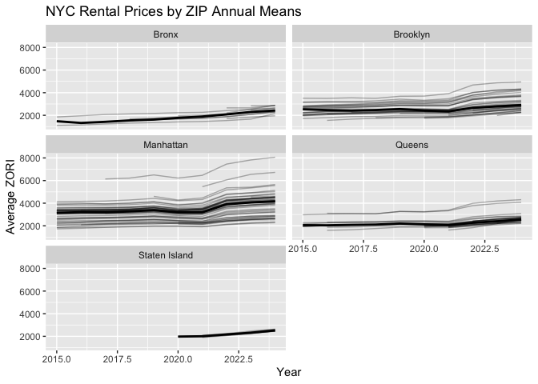
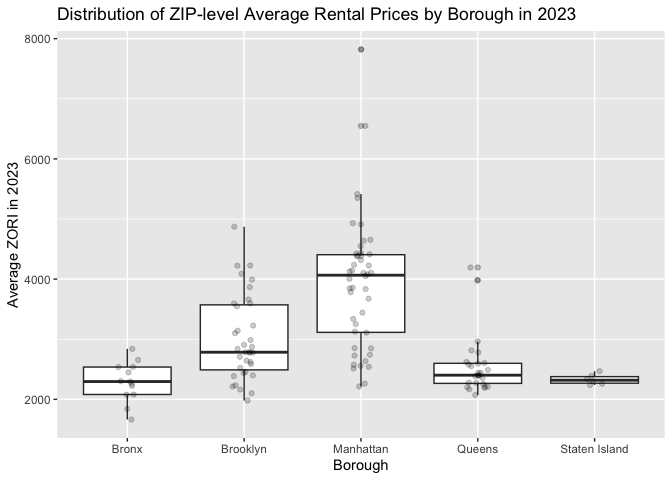

p8105_hw3_yz4982
================
Yuanyuan Zhang

## Promblem 1

### Library

``` r
library(tidyverse)
```

    ## ── Attaching core tidyverse packages ──────────────────────── tidyverse 2.0.0 ──
    ## ✔ dplyr     1.1.4     ✔ readr     2.1.5
    ## ✔ forcats   1.0.0     ✔ stringr   1.5.1
    ## ✔ ggplot2   3.5.2     ✔ tibble    3.3.0
    ## ✔ lubridate 1.9.4     ✔ tidyr     1.3.1
    ## ✔ purrr     1.1.0     
    ## ── Conflicts ────────────────────────────────────────── tidyverse_conflicts() ──
    ## ✖ dplyr::filter() masks stats::filter()
    ## ✖ dplyr::lag()    masks stats::lag()
    ## ℹ Use the conflicted package (<http://conflicted.r-lib.org/>) to force all conflicts to become errors

``` r
library(p8105.datasets)
library(forcats) 
library(janitor)
```

    ## 
    ## Attaching package: 'janitor'
    ## 
    ## The following objects are masked from 'package:stats':
    ## 
    ##     chisq.test, fisher.test

``` r
library(lubridate)
library(ggplot2)
library(patchwork)

data("instacart")
```

### Description

``` r
n_rows <- nrow(instacart)
n_cols <- ncol(instacart)

n_users       <- n_distinct(instacart$user_id)
n_orders      <- n_distinct(instacart$order_id)
n_products    <- n_distinct(instacart$product_id)
n_aisles      <- n_distinct(instacart$aisle)

cat(
  "rows:", n_rows,
  "columns:", n_cols, "\n",
  "unique users:", n_users,
  "unique orders:", n_orders, "\n",
  "unique products:", n_products,
  "unique aisles:", n_aisles, "\n"
)
```

    ## rows: 1384617 columns: 15 
    ##  unique users: 131209 unique orders: 131209 
    ##  unique products: 39123 unique aisles: 134

``` r
# check variables and type
# glimpse(instacart)

# key varibles
set.seed(8105)
instacart |> 
  select(order_id, user_id, product_id, product_name, aisle, department, 
         add_to_cart_order, reordered, order_dow, order_hour_of_day) |>
  slice_sample(n = 5)
```

    ## # A tibble: 5 × 10
    ##   order_id user_id product_id product_name    aisle department add_to_cart_order
    ##      <int>   <int>      <int> <chr>           <chr> <chr>                  <int>
    ## 1   433013  147577      24852 Banana          fres… produce                    5
    ## 2   558448  158406      26348 Mixed Fruit Fr… frui… snacks                     2
    ## 3   143727  133129      42406 Multi-Surface … clea… household                 10
    ## 4  1545471   55815      35939 Organic Jalape… fres… produce                    2
    ## 5  3142032  114172      26209 Limes           fres… produce                    6
    ## # ℹ 3 more variables: reordered <int>, order_dow <int>, order_hour_of_day <int>

### Number of Aisles

``` r
# Counting the number of products ordered per aisle
aisle_counts <- instacart |>
  count(aisle, name = "n_items") |>
  arrange(desc(n_items))

# Total aisle 
n_aisles <- nrow(aisle_counts)
n_aisles
```

    ## [1] 134

``` r
# Top 5 most ordered aisles
top_aisles <- aisle_counts |> slice_max(n_items, n = 5)
top_aisles
```

    ## # A tibble: 5 × 2
    ##   aisle                      n_items
    ##   <chr>                        <int>
    ## 1 fresh vegetables            150609
    ## 2 fresh fruits                150473
    ## 3 packaged vegetables fruits   78493
    ## 4 yogurt                       55240
    ## 5 packaged cheese              41699

### Plot The Number of Items Ordered in Each Aisle

``` r
plot_df <- aisle_counts |>
  filter(n_items > 10000) |>
  mutate(aisle = fct_reorder(aisle, n_items))

p <- ggplot(plot_df, aes(x = n_items, y = aisle)) +
  geom_col() +
  labs(
    title = "Number of items ordered by aisle (> 10,000)",
    x = "Items ordered",
    y = "Aisle"
  )

ggplot2::ggsave(
  filename = "Figures/aisle_items_over_10k.png",
  plot = p,
  width = 8, height = 5, units = "in", dpi = 300
)

print (p)
```

<!-- -->

### Table of Top 3 Popular Items in Each of The Aisles

``` r
top3_tbl <- instacart |>
  # Keep only rows from these three aisles
  filter(aisle %in% c("baking ingredients",
                      "dog food care",
                      "packaged vegetables fruits")) |>
  # Count
  count(aisle, product_name, name = "times_ordered", sort = TRUE) |>
  # Make group
  group_by(aisle) |>
  # Take the top 3 products each aisle
  slice_max(times_ordered, n = 3) |>
  # Order by aisle
  arrange(aisle, desc(times_ordered)) |>
  # Assign ranks
  mutate(rank_in_aisle = row_number()) |>
  select(aisle, rank_in_aisle, product_name, times_ordered) |>
  ungroup()

# Print
top3_tbl
```

    ## # A tibble: 9 × 4
    ##   aisle                      rank_in_aisle product_name            times_ordered
    ##   <chr>                              <int> <chr>                           <int>
    ## 1 baking ingredients                     1 Light Brown Sugar                 499
    ## 2 baking ingredients                     2 Pure Baking Soda                  387
    ## 3 baking ingredients                     3 Cane Sugar                        336
    ## 4 dog food care                          1 Snack Sticks Chicken &…            30
    ## 5 dog food care                          2 Organix Chicken & Brow…            28
    ## 6 dog food care                          3 Small Dog Biscuits                 26
    ## 7 packaged vegetables fruits             1 Organic Baby Spinach             9784
    ## 8 packaged vegetables fruits             2 Organic Raspberries              5546
    ## 9 packaged vegetables fruits             3 Organic Blueberries              4966

### Mean Hour of The Day

``` r
mean_hour_tbl <- instacart |>
  filter(product_name %in% c("Pink Lady Apples", "Coffee Ice Cream")) |>
  mutate(
    # Instacart encodes convert
    day_convert = factor(order_dow, levels = 0:6,
                 labels = c("Sun","Mon","Tue","Wed","Thu","Fri","Sat"))
  ) |>
  # Make group
  group_by(product_name, day_convert) |>
  # Calculate the mean
  summarise(mean_hour = mean(order_hour_of_day), .groups = "drop") |>
  # Make 2*7 table
  tidyr::pivot_wider(names_from = day_convert, values_from = mean_hour) |>
  rename(Product = product_name)

# Print
mean_hour_tbl
```

    ## # A tibble: 2 × 8
    ##   Product            Sun   Mon   Tue   Wed   Thu   Fri   Sat
    ##   <chr>            <dbl> <dbl> <dbl> <dbl> <dbl> <dbl> <dbl>
    ## 1 Coffee Ice Cream  13.8  14.3  15.4  15.3  15.2  12.3  13.8
    ## 2 Pink Lady Apples  13.4  11.4  11.7  14.2  11.6  12.8  11.9

## Promblem 2

### Import Data

``` r
zip_code_df = 
  read_csv("p8105_hw3_yz4982_files/zillow_data/Zip Codes.csv", 
           na = c("NA", ".", ""))
```

    ## Rows: 322 Columns: 7
    ## ── Column specification ────────────────────────────────────────────────────────
    ## Delimiter: ","
    ## chr (4): County, County Code, File Date, Neighborhood
    ## dbl (3): State FIPS, County FIPS, ZipCode
    ## 
    ## ℹ Use `spec()` to retrieve the full column specification for this data.
    ## ℹ Specify the column types or set `show_col_types = FALSE` to quiet this message.

``` r
# check variables and type
glimpse(zip_code_df)
```

    ## Rows: 322
    ## Columns: 7
    ## $ County        <chr> "Bronx", "Bronx", "Bronx", "Bronx", "Bronx", "Bronx", "B…
    ## $ `State FIPS`  <dbl> 36, 36, 36, 36, 36, 36, 36, 36, 36, 36, 36, 36, 36, 36, …
    ## $ `County Code` <chr> "005", "005", "005", "005", "005", "005", "005", "005", …
    ## $ `County FIPS` <dbl> 36005, 36005, 36005, 36005, 36005, 36005, 36005, 36005, …
    ## $ ZipCode       <dbl> 10451, 10452, 10453, 10454, 10455, 10456, 10457, 10458, …
    ## $ `File Date`   <chr> "7/25/07", "7/25/07", "7/25/07", "7/25/07", "7/25/07", "…
    ## $ Neighborhood  <chr> "High Bridge and Morrisania", "High Bridge and Morrisani…

``` r
zori_raw = 
  read_csv("p8105_hw3_yz4982_files/zillow_data/Zip_zori_uc_sfrcondomfr_sm_month_NYC.csv", 
           na = c("NA", ".", ""))
```

    ## Rows: 149 Columns: 125
    ## ── Column specification ────────────────────────────────────────────────────────
    ## Delimiter: ","
    ## chr   (6): RegionType, StateName, State, City, Metro, CountyName
    ## dbl (119): RegionID, SizeRank, RegionName, 2015-01-31, 2015-02-28, 2015-03-3...
    ## 
    ## ℹ Use `spec()` to retrieve the full column specification for this data.
    ## ℹ Specify the column types or set `show_col_types = FALSE` to quiet this message.

``` r
# Check variables and type
# glimpse(zip_code_df)
# glimpse(zori_raw )
```

### Clean Data

``` r
zori_long <- zori_raw |>
  rename(zip = RegionName) |>
  pivot_longer(
    cols = matches("^\\d{4}-\\d{2}-\\d{2}$"),
    names_to = "month",
    values_to = "zori"
  ) |>
  mutate(month = lubridate::ymd(month)) |>
  # keep only 2015-01-31 to 2024-08-31
  filter(month >= ymd("2015-01-31"),
         month <= ymd("2024-08-31"))
```

### Statisic Calculate

``` r
zip_month_counts <- zori_long |>
  group_by(zip) |>
  summarise(months_observed = sum(!is.na(zori)), .groups = "drop")

# ZIP codes are observed 116 times
n_exact_116 <- sum(zip_month_counts$months_observed == 116)

# Observed fewer than 10 times
n_fewer_10  <- sum(zip_month_counts$months_observed < 10)

# Print
cat("ZIP codes are observed 116 times：", n_exact_116, "\n")
```

    ## ZIP codes are observed 116 times： 48

``` r
cat("Observed fewer than 10 times：", n_fewer_10, "\n")
```

    ## Observed fewer than 10 times： 26

Make a table see

``` r
summary_tbl <- zip_month_counts |>
  mutate(coverage = case_when(
    months_observed == 116 ~ "total 116 month",
    months_observed < 10   ~ "<10 month",
    TRUE                   ~ "partial 10–115 month"
  )) |>
  count(coverage, name = "count zip") |>
  arrange(match(coverage,
                c("total 116 month","<10 month","partial 10–115 month")))

summary_tbl
```

    ## # A tibble: 3 × 2
    ##   coverage             `count zip`
    ##   <chr>                      <int>
    ## 1 total 116 month               48
    ## 2 <10 month                     26
    ## 3 partial 10–115 month          75

Zillow reports a monthly value only when there are enough valid rental
listings; otherwise the month is NA. ZIPs with active residential
markets therefore show values in all 116 months.Non-residential or
special-use ZIPs and places with very few listings are often missing
many months.Occasional gaps also come from boundary changes.

### Reader-friendly Table

``` r
# ZIP to Borough
borough_xwalk <- data.frame(
  County  = c("New York","Kings","Queens","Bronx","Richmond"),
  borough = c("Manhattan","Brooklyn","Queens","Bronx","Staten Island"),
  stringsAsFactors = FALSE
)

zip_to_borough <- zip_code_df |>
  select(ZipCode, County) |>
  left_join(borough_xwalk, by = "County") |>
  transmute(zip = as.integer(ZipCode), borough)

# Take the average of the ZIPs within the borough-year.
borough_year <- zori_long |>
  mutate(zip = as.integer(zip),
         year = year(month)) |>
  inner_join(zip_to_borough, by = "zip") |>
  group_by(borough, zip, year) |>
  summarise(zip_year_mean = mean(zori, na.rm = TRUE), .groups = "drop") |>
  group_by(borough, year) |>
  summarise(avg_rent = round(mean(zip_year_mean, na.rm = TRUE)), .groups = "drop")
```

    ## Warning in inner_join(mutate(zori_long, zip = as.integer(zip), year = year(month)), : Detected an unexpected many-to-many relationship between `x` and `y`.
    ## ℹ Row 4757 of `x` matches multiple rows in `y`.
    ## ℹ Row 256 of `y` matches multiple rows in `x`.
    ## ℹ If a many-to-many relationship is expected, set `relationship =
    ##   "many-to-many"` to silence this warning.

``` r
# Make Table
table_wide <- borough_year |>
  arrange(borough, year) |>
  pivot_wider(names_from = year, values_from = avg_rent)

# Print
print(table_wide)
```

    ## # A tibble: 5 × 11
    ##   borough  `2015` `2016` `2017` `2018` `2019` `2020` `2021` `2022` `2023` `2024`
    ##   <chr>     <dbl>  <dbl>  <dbl>  <dbl>  <dbl>  <dbl>  <dbl>  <dbl>  <dbl>  <dbl>
    ## 1 Bronx      1478   1478   1539   1640   1704   1806   1860   2058   2289   2503
    ## 2 Brooklyn   2489   2500   2535   2547   2627   2540   2525   2859   3009   3110
    ## 3 Manhatt…   2975   3007   3109   3160   3285   3091   3163   3753   3921   4108
    ## 4 Queens     2207   2231   2263   2292   2388   2244   2164   2407   2549   2697
    ## 5 Staten …    NaN    NaN    NaN    NaN    NaN   1978   2003   2150   2332   2575

## Plot Showing NYC Rental Prices

``` r
# ZIP annual mean
zip_year <- zori_long |>
  mutate(zip = as.integer(zip),
         year = lubridate::year(month)) |>
  inner_join(zip_to_borough, by = "zip") |>
  group_by(borough, zip, year) |>
  summarise(zip_year_mean = mean(zori, na.rm = TRUE), .groups = "drop")
```

    ## Warning in inner_join(mutate(zori_long, zip = as.integer(zip), year = lubridate::year(month)), : Detected an unexpected many-to-many relationship between `x` and `y`.
    ## ℹ Row 4757 of `x` matches multiple rows in `y`.
    ## ℹ Row 256 of `y` matches multiple rows in `x`.
    ## ℹ If a many-to-many relationship is expected, set `relationship =
    ##   "many-to-many"` to silence this warning.

``` r
# Borough median
borough_year_median <- zip_year |>
  group_by(borough, year) |>
  summarise(median_rent = median(zip_year_mean, na.rm = TRUE), .groups = "drop")


# Plot thin lines with ZIPs, thick line is borough median
ggplot(zip_year, aes(x = year, y = zip_year_mean, group = zip)) +
  geom_line(alpha = 0.3) +
  geom_line(data = borough_year_median,
            aes(y = median_rent, group = NULL),
            linewidth = 1) +
  facet_wrap(~ borough, ncol = 2) +
  labs(
    title = "NYC Rental Prices by ZIP Annual Means",
    x = "Year",
    y = "Average ZORI"
  )
```

    ## Warning: Removed 531 rows containing missing values or values outside the scale range
    ## (`geom_line()`).

<!-- -->
For the full period, Manhattan is the highest, Staten Island is the
lowest, Brooklyn/Queens is in the middle, and the Bronx is lower than
Brooklyn/Queens but has risen rapidly in recent years. The distribution
of ZIP prices is more spread out in Manhattan and Brooklyn, suggesting
greater variation, and tighter in the Bronx and Staten Island,
suggesting less variation. The ZIP price distribution is more spread out
in Manhattan and Brooklyn, suggesting large differences, and tighter in
Bronx and Staten Island, suggesting small differences).

## Plot of ZIP-code-level rental prices across boroughs in 2023

``` r
# Filter 2023 year calculate mean
zip_2023 <- zori_long |>
  mutate(year = year(month), zip = as.integer(zip)) |>
  filter(year == 2023) |>
  inner_join(zip_to_borough, by = "zip") |>
  group_by(borough, zip) |>
  summarise(zip_mean_2023 = mean(zori, na.rm = TRUE), .groups = "drop") |>
  filter(is.finite(zip_mean_2023))  # 去掉全年都缺失的 ZIP
```

    ## Warning in inner_join(filter(mutate(zori_long, year = year(month), zip = as.integer(zip)), : Detected an unexpected many-to-many relationship between `x` and `y`.
    ## ℹ Row 493 of `x` matches multiple rows in `y`.
    ## ℹ Row 256 of `y` matches multiple rows in `x`.
    ## ℹ If a many-to-many relationship is expected, set `relationship =
    ##   "many-to-many"` to silence this warning.

``` r
# Create box plot
ggplot(zip_2023, aes(x = borough, y = zip_mean_2023)) +
  geom_boxplot(outlier.alpha = 0.3) +
  geom_jitter(width = 0.1, alpha = 0.2) +
  labs(
    title = "Distribution of ZIP-level Average Rental Prices by Borough in 2023",
    x = "Borough",
    y = "Average ZORI in 2023"
  )
```

<!-- -->
For median, Manhattan is the highest and Staten Island is the lowest;
Brooklyn and Queens is in the middle and Bronx is slightly lower.
Manhattan and Brooklyn have longer box and more dispersed scatter,
suggesting greater variation among ZIPs, Bronx and Staten Island are
more centralized.

``` r
p1 <- ggplot(zip_year, aes(x = year, y = zip_year_mean, group = zip)) +
  geom_line(alpha = 0.3) +
  geom_line(data = borough_year_median,
            aes(y = median_rent, group = NULL),
            linewidth = 1) +
  facet_wrap(~ borough, ncol = 2) +
  labs(
    title = "NYC Rental Prices by ZIP Annual Means",
    x = "Year",
    y = "Average ZORI"
  )

p2 <- ggplot(zip_2023, aes(x = borough, y = zip_mean_2023)) +
  geom_boxplot(outlier.alpha = 0.3) +
  geom_jitter(width = 0.1, alpha = 0.2) +
  labs(
    title = "Distribution of ZIP-level Average Rental Prices by Borough in 2023",
    x = "Borough",
    y = "Average ZORI in 2023"
  )

# --- 合并并导出 ---
combined <- p1 / p2
ggplot2::ggsave("Figures/nyc_rental_prices_combined.png", combined, width = 10, height = 10, dpi = 300)
```

    ## Warning: Removed 531 rows containing missing values or values outside the scale range
    ## (`geom_line()`).

``` r
combined 
```

    ## Warning: Removed 531 rows containing missing values or values outside the scale range
    ## (`geom_line()`).

<!-- -->
