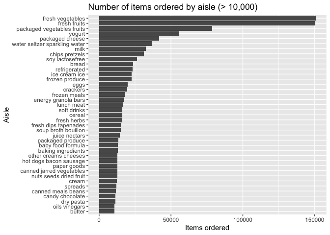

p8105_hw3_yz4982
================
Yuanyuan Zhang

## Promblem 1

### Short Description

``` r
library(tidyverse)
```

    ## ── Attaching core tidyverse packages ──────────────────────── tidyverse 2.0.0 ──
    ## ✔ dplyr     1.1.4     ✔ readr     2.1.5
    ## ✔ forcats   1.0.0     ✔ stringr   1.5.1
    ## ✔ ggplot2   3.5.2     ✔ tibble    3.3.0
    ## ✔ lubridate 1.9.4     ✔ tidyr     1.3.1
    ## ✔ purrr     1.1.0     
    ## ── Conflicts ────────────────────────────────────────── tidyverse_conflicts() ──
    ## ✖ dplyr::filter() masks stats::filter()
    ## ✖ dplyr::lag()    masks stats::lag()
    ## ℹ Use the conflicted package (<http://conflicted.r-lib.org/>) to force all conflicts to become errors

``` r
library(p8105.datasets)
library(forcats) 
library(janitor)
```

    ## 
    ## Attaching package: 'janitor'
    ## 
    ## The following objects are masked from 'package:stats':
    ## 
    ##     chisq.test, fisher.test

``` r
library(lubridate)

data("instacart")
```

### Description

``` r
n_rows <- nrow(instacart)
n_cols <- ncol(instacart)

n_users       <- n_distinct(instacart$user_id)
n_orders      <- n_distinct(instacart$order_id)
n_products    <- n_distinct(instacart$product_id)
n_aisles      <- n_distinct(instacart$aisle)

cat(
  "rows:", n_rows,
  "columns:", n_cols, "\n",
  "unique users:", n_users,
  "unique orders:", n_orders, "\n",
  "unique products:", n_products,
  "unique aisles:", n_aisles, "\n"
)
```

    ## rows: 1384617 columns: 15 
    ##  unique users: 131209 unique orders: 131209 
    ##  unique products: 39123 unique aisles: 134

``` r
# check variables and type
glimpse(instacart)
```

    ## Rows: 1,384,617
    ## Columns: 15
    ## $ order_id               <int> 1, 1, 1, 1, 1, 1, 1, 1, 36, 36, 36, 36, 36, 36,…
    ## $ product_id             <int> 49302, 11109, 10246, 49683, 43633, 13176, 47209…
    ## $ add_to_cart_order      <int> 1, 2, 3, 4, 5, 6, 7, 8, 1, 2, 3, 4, 5, 6, 7, 8,…
    ## $ reordered              <int> 1, 1, 0, 0, 1, 0, 0, 1, 0, 1, 0, 1, 1, 1, 1, 1,…
    ## $ user_id                <int> 112108, 112108, 112108, 112108, 112108, 112108,…
    ## $ eval_set               <chr> "train", "train", "train", "train", "train", "t…
    ## $ order_number           <int> 4, 4, 4, 4, 4, 4, 4, 4, 23, 23, 23, 23, 23, 23,…
    ## $ order_dow              <int> 4, 4, 4, 4, 4, 4, 4, 4, 6, 6, 6, 6, 6, 6, 6, 6,…
    ## $ order_hour_of_day      <int> 10, 10, 10, 10, 10, 10, 10, 10, 18, 18, 18, 18,…
    ## $ days_since_prior_order <int> 9, 9, 9, 9, 9, 9, 9, 9, 30, 30, 30, 30, 30, 30,…
    ## $ product_name           <chr> "Bulgarian Yogurt", "Organic 4% Milk Fat Whole …
    ## $ aisle_id               <int> 120, 108, 83, 83, 95, 24, 24, 21, 2, 115, 53, 1…
    ## $ department_id          <int> 16, 16, 4, 4, 15, 4, 4, 16, 16, 7, 16, 4, 16, 2…
    ## $ aisle                  <chr> "yogurt", "other creams cheeses", "fresh vegeta…
    ## $ department             <chr> "dairy eggs", "dairy eggs", "produce", "produce…

``` r
# key varibles
set.seed(8105)
instacart |> 
  select(order_id, user_id, product_id, product_name, aisle, department, 
         add_to_cart_order, reordered, order_dow, order_hour_of_day) |>
  slice_sample(n = 5)
```

    ## # A tibble: 5 × 10
    ##   order_id user_id product_id product_name    aisle department add_to_cart_order
    ##      <int>   <int>      <int> <chr>           <chr> <chr>                  <int>
    ## 1   433013  147577      24852 Banana          fres… produce                    5
    ## 2   558448  158406      26348 Mixed Fruit Fr… frui… snacks                     2
    ## 3   143727  133129      42406 Multi-Surface … clea… household                 10
    ## 4  1545471   55815      35939 Organic Jalape… fres… produce                    2
    ## 5  3142032  114172      26209 Limes           fres… produce                    6
    ## # ℹ 3 more variables: reordered <int>, order_dow <int>, order_hour_of_day <int>

### Number of Aisles

``` r
# Counting the number of products ordered per aisle
aisle_counts <- instacart |>
  count(aisle, name = "n_items") |>
  arrange(desc(n_items))

# Total aisle 
n_aisles <- nrow(aisle_counts)
n_aisles
```

    ## [1] 134

``` r
# Top 10 most ordered aisles
top_aisles <- aisle_counts |> slice_max(n_items, n = 10)
top_aisles
```

    ## # A tibble: 10 × 2
    ##    aisle                         n_items
    ##    <chr>                           <int>
    ##  1 fresh vegetables               150609
    ##  2 fresh fruits                   150473
    ##  3 packaged vegetables fruits      78493
    ##  4 yogurt                          55240
    ##  5 packaged cheese                 41699
    ##  6 water seltzer sparkling water   36617
    ##  7 milk                            32644
    ##  8 chips pretzels                  31269
    ##  9 soy lactosefree                 26240
    ## 10 bread                           23635

### Plot The Number of Items Ordered in Each Aisle

``` r
plot_df <- aisle_counts |>
  filter(n_items > 10000) |>
  mutate(aisle = fct_reorder(aisle, n_items))

p <- ggplot(plot_df, aes(x = n_items, y = aisle)) +
  geom_col() +
  labs(
    title = "Number of items ordered by aisle (> 10,000)",
    x = "Items ordered",
    y = "Aisle"
  )

ggplot2::ggsave(
  filename = "Figures/aisle_items_over_10k.png",
  plot = p,
  width = 8, height = 5, units = "in", dpi = 300
)

print (p)
```

<!-- -->

### Table of Top 3 Popular Items in Each of The Aisles

``` r
top3_tbl <- instacart |>
  # Keep only rows from these three aisles
  filter(aisle %in% c("baking ingredients",
                      "dog food care",
                      "packaged vegetables fruits")) |>
  # Count
  count(aisle, product_name, name = "times_ordered", sort = TRUE) |>
  # Make group
  group_by(aisle) |>
  # Take the top 3 products each aisle
  slice_max(times_ordered, n = 3) |>
  # Order by aisle
  arrange(aisle, desc(times_ordered)) |>
  # Assign ranks
  mutate(rank_in_aisle = row_number()) |>
  select(aisle, rank_in_aisle, product_name, times_ordered) |>
  ungroup()

# Print
top3_tbl
```

    ## # A tibble: 9 × 4
    ##   aisle                      rank_in_aisle product_name            times_ordered
    ##   <chr>                              <int> <chr>                           <int>
    ## 1 baking ingredients                     1 Light Brown Sugar                 499
    ## 2 baking ingredients                     2 Pure Baking Soda                  387
    ## 3 baking ingredients                     3 Cane Sugar                        336
    ## 4 dog food care                          1 Snack Sticks Chicken &…            30
    ## 5 dog food care                          2 Organix Chicken & Brow…            28
    ## 6 dog food care                          3 Small Dog Biscuits                 26
    ## 7 packaged vegetables fruits             1 Organic Baby Spinach             9784
    ## 8 packaged vegetables fruits             2 Organic Raspberries              5546
    ## 9 packaged vegetables fruits             3 Organic Blueberries              4966

### Mean hour tbl

``` r
mean_hour_tbl <- instacart |>
  filter(product_name %in% c("Pink Lady Apples", "Coffee Ice Cream")) |>
  mutate(
    # Instacart encodes convert
    day_convert = factor(order_dow, levels = 0:6,
                 labels = c("Sun","Mon","Tue","Wed","Thu","Fri","Sat"))
  ) |>
  # Make group
  group_by(product_name, day_convert) |>
  # Calculate the mean
  summarise(mean_hour = mean(order_hour_of_day), .groups = "drop") |>
  # Make 2*7 table
  tidyr::pivot_wider(names_from = day_convert, values_from = mean_hour) |>
  rename(Product = product_name)

mean_hour_tbl
```

    ## # A tibble: 2 × 8
    ##   Product            Sun   Mon   Tue   Wed   Thu   Fri   Sat
    ##   <chr>            <dbl> <dbl> <dbl> <dbl> <dbl> <dbl> <dbl>
    ## 1 Coffee Ice Cream  13.8  14.3  15.4  15.3  15.2  12.3  13.8
    ## 2 Pink Lady Apples  13.4  11.4  11.7  14.2  11.6  12.8  11.9

## Promblem 2

### Import Data

``` r
zip_code_df = 
  read_csv("p8105_hw3_yz4982_files/zillow_data/Zip Codes.csv", 
           na = c("NA", ".", ""))
```

    ## Rows: 322 Columns: 7
    ## ── Column specification ────────────────────────────────────────────────────────
    ## Delimiter: ","
    ## chr (4): County, County Code, File Date, Neighborhood
    ## dbl (3): State FIPS, County FIPS, ZipCode
    ## 
    ## ℹ Use `spec()` to retrieve the full column specification for this data.
    ## ℹ Specify the column types or set `show_col_types = FALSE` to quiet this message.

``` r
# check variables and type
glimpse(zip_code_df)
```

    ## Rows: 322
    ## Columns: 7
    ## $ County        <chr> "Bronx", "Bronx", "Bronx", "Bronx", "Bronx", "Bronx", "B…
    ## $ `State FIPS`  <dbl> 36, 36, 36, 36, 36, 36, 36, 36, 36, 36, 36, 36, 36, 36, …
    ## $ `County Code` <chr> "005", "005", "005", "005", "005", "005", "005", "005", …
    ## $ `County FIPS` <dbl> 36005, 36005, 36005, 36005, 36005, 36005, 36005, 36005, …
    ## $ ZipCode       <dbl> 10451, 10452, 10453, 10454, 10455, 10456, 10457, 10458, …
    ## $ `File Date`   <chr> "7/25/07", "7/25/07", "7/25/07", "7/25/07", "7/25/07", "…
    ## $ Neighborhood  <chr> "High Bridge and Morrisania", "High Bridge and Morrisani…

``` r
zip_NYC_df = 
  read_csv("p8105_hw3_yz4982_files/zillow_data/Zip_zori_uc_sfrcondomfr_sm_month_NYC.csv", 
           na = c("NA", ".", ""))
```

    ## Rows: 149 Columns: 125
    ## ── Column specification ────────────────────────────────────────────────────────
    ## Delimiter: ","
    ## chr   (6): RegionType, StateName, State, City, Metro, CountyName
    ## dbl (119): RegionID, SizeRank, RegionName, 2015-01-31, 2015-02-28, 2015-03-3...
    ## 
    ## ℹ Use `spec()` to retrieve the full column specification for this data.
    ## ℹ Specify the column types or set `show_col_types = FALSE` to quiet this message.

``` r
# check variables and type
# glimpse(zip_code_df)
# glimpse(zip_NYC_df)
```

### WHAT
